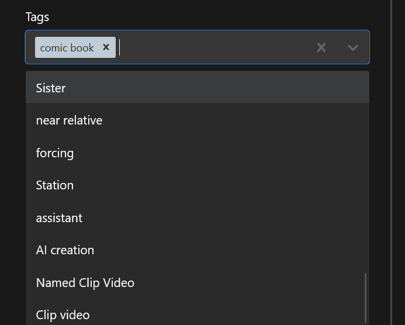
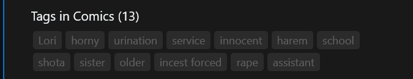
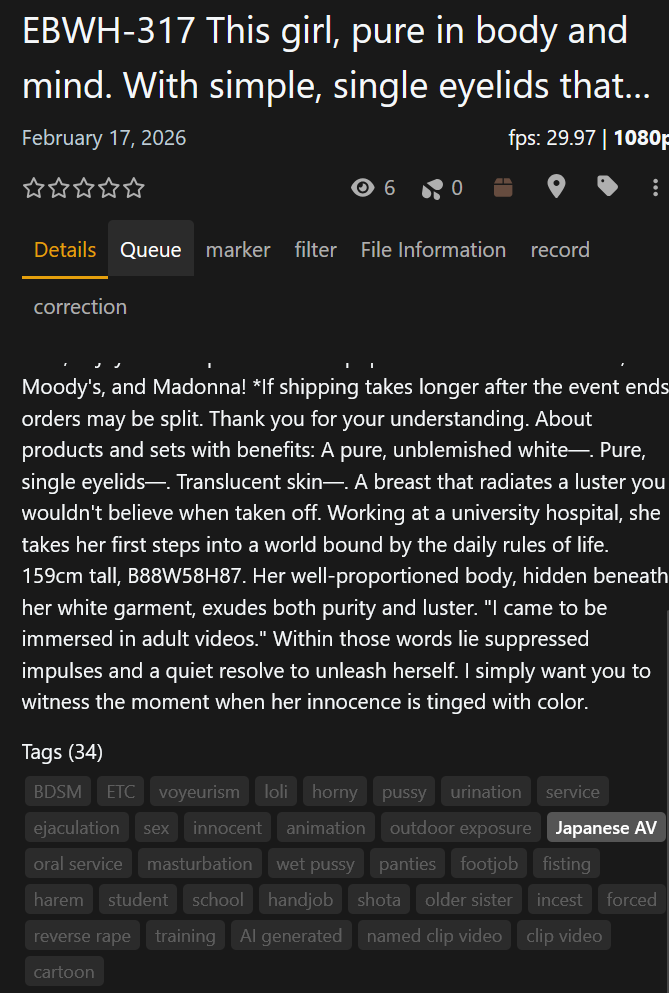
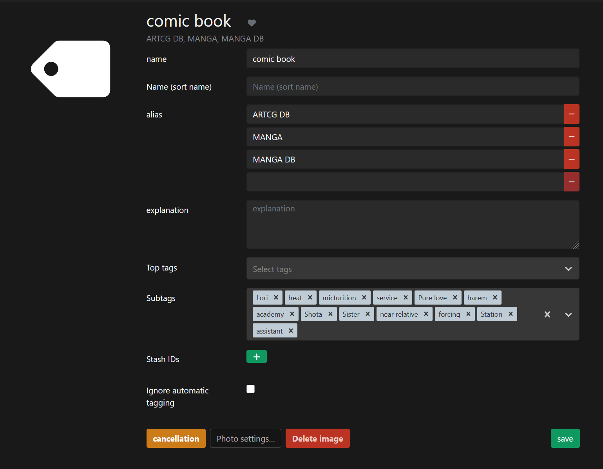

# stash_plugin_custom

Custom Stash plugins by kokkeng1.

## Source

Add this repository as a plugin source in [Stash](https://stashapp.cc):

```
https://kokkeng1.github.io/stash_plugin_custom/main/index.yml
```

**Settings → Plugins → Add Source**

---

## Tags Panel

This plugin adds a toggleable tag panel to Scene, Gallery, and Image pages, allowing for easier tag management compared to the default selection menu.

> Note: The code for this plugin was generated with the assistance of AI.

### 🚀 Features

- **Interactive Tag Panel:** Replaces the standard tag display with a badge-based panel.

- **Easy Toggling:** Tags can be attached or detached instantly by clicking the badges — no more searching through long dropdown lists in the edit menu.

  | Before | After |
  |--------|-------|
  |  |  |

- **Visual Status:** Attached tags are highlighted, while unattached tags are dimmed.

- **Detail Panel:** Optionally replaces the read-only tag list in the detail tab with this interactive panel.

  

- **Hierarchy Filtering:** Optional setting to show only child tags if a parent tag is already attached.

  

### ⚙️ Settings

Available in **Settings → Plugins → Tags Panel**:

| Option | Description |
|--------|-------------|
| **Show in Detail Panel** | Replaces the read-only tag list in the detail tab with the interactive panel. |
| **Show Child Tags Only** | Filters the panel to only display sub-tags of currently attached tags. |
